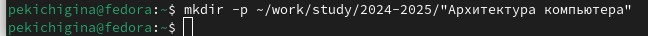
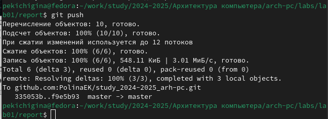

---
## Front matter
title: "Отчет по лабораторной работе №2"
subtitle: "дисциплина: Архитектура компьютеров"
author: "Кичигина Полина Евгеньевна"

## Generic otions
lang: ru-RU
toc-title: "Содержание"

## Bibliography
bibliography: bib/cite.bib
csl: pandoc/csl/gost-r-7-0-5-2008-numeric.csl

## Pdf output format
toc: true # Table of contents
toc-depth: 2
lof: true # List of figures
lot: true # List of tables
fontsize: 12pt
linestretch: 1.5
papersize: a4
documentclass: scrreprt
## I18n polyglossia
polyglossia-lang:
  name: russian
  options:
	- spelling=modern
	- babelshorthands=true
polyglossia-otherlangs:
  name: english
## I18n babel
babel-lang: russian
babel-otherlangs: english
## Fonts
mainfont: IBM Plex Serif
romanfont: IBM Plex Serif
sansfont: IBM Plex Sans
monofont: IBM Plex Mono
mathfont: STIX Two Math
mainfontoptions: Ligatures=Common,Ligatures=TeX,Scale=0.94
romanfontoptions: Ligatures=Common,Ligatures=TeX,Scale=0.94
sansfontoptions: Ligatures=Common,Ligatures=TeX,Scale=MatchLowercase,Scale=0.94
monofontoptions: Scale=MatchLowercase,Scale=0.94,FakeStretch=0.9
mathfontoptions:
## Biblatex
biblatex: true
biblio-style: "gost-numeric"
biblatexoptions:
  - parentracker=true
  - backend=biber
  - hyperref=auto
  - language=auto
  - autolang=other*
  - citestyle=gost-numeric
## Pandoc-crossref LaTeX customization
figureTitle: "Рис."
tableTitle: "Таблица"
listingTitle: "Листинг"
lofTitle: "Список иллюстраций"
lotTitle: "Список таблиц"
lolTitle: "Листинги"
## Misc options
indent: true
header-includes:
  - \usepackage{indentfirst}
  - \usepackage{float} # keep figures where there are in the text
  - \floatplacement{figure}{H} # keep figures where there are in the text
---

# Цель работы

Целью работы является изучение идеологии и применение средств контроля версий.
Приобретение практических навыков с системой git.

# Выполнение лабораторной работы
Задание №1 Базовая настройка git

1. Сначала сделаем предварительную конфигурацию git(рис. [-@fig:001])

{#fig:001 width=70%}

2. Настроим utf-8 в выводе сообщений git(рис. [-@fig:002])

{#fig:002 width=70%}

3. Зададим имя начальной ветки (будем называть её master)(рис. [-@fig:003])

{#fig:003 width=70%}

4. Параметр autocrlf(рис. [-@fig:004])

{#fig:004 width=70%}

5. Параметр safecrlf(рис. [-@fig:005])

{#fig:005 width=70%}

Задание №2. Создание SSH ключа.

Для последующей идентификации пользователя на сервере репозиториев

необходимо сгенерировать пару ключей (приватный и открытый)(рис. [-@fig:006])

{#fig:006 width=70%}

Далее необходимо загрузить сгенерённый ключ(рис. [-@fig:007])

{#fig:007 width=70%}

Заходим в свой аккаунт на сайте github и переходим в настройки(рис. [-@fig:008])

{#fig:008 width=70%}

Задание №3. Создание рабочего пространства и репозитория курса на основе
шаблона.

Открываем терминал для создания рабочего пространства(рис. [-@fig:009])

{#fig:009 width=70%}

Задание №4. Создание репозитория курса.

Переходим на страницу репозитория с шаблоном(рис. [-@fig:010])

{#fig:010 width=70%}

Открываем терминал(рис. [-@fig:011])

{#fig:011 width=70%}

Задание №5. Настройка каталога курса.

Переходим в каталог курса(рис. [-@fig:012])

{#fig:012 width=70%}

Отправьте файлы на сервер(рис. [-@fig:013])

{#fig:013 width=70%}

# Задания для самостоятельной работы

1.Создайте отчет по выполнению лабораторной работы в соответствующем каталоге
рабочего пространства (labs>lab02>report)(рис. [-@fig:014])

{#fig:014 width=70%}

2. Скопируйте отчеты по выполнению предыдущих лабораторных работ в соответствующие каталоги созданного рабочего пространства. (рис. [-@fig:015])

{#fig:015 width=70%}

3. Загрузите файлы на github (рис. [-@fig:016]) 

{#fig:016 width=70%}

(рис. [-@fig:017])

{#fig:017 width=70%}

# Выводы

В ходе выполнения лабораторной работы мы познакомились с системой контроля git, выучили команды для работы с ним, создали свой репозиторий на платформе github, где в последствии будут храниться все будущие отчёты по лабораторным работам.

