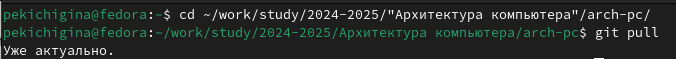
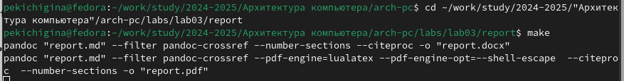
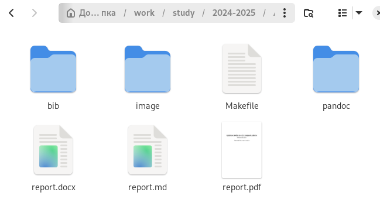
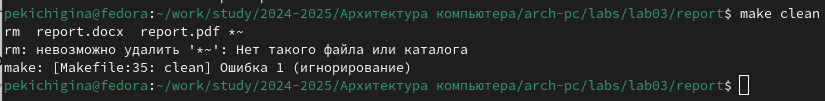
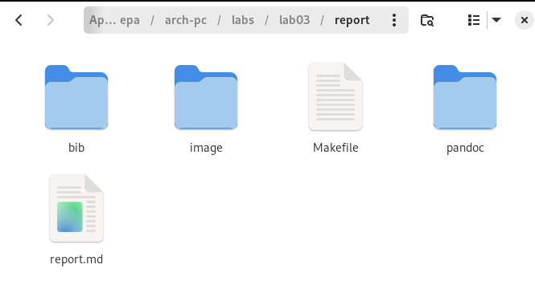
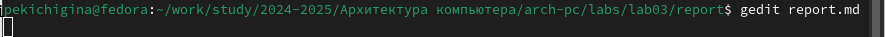
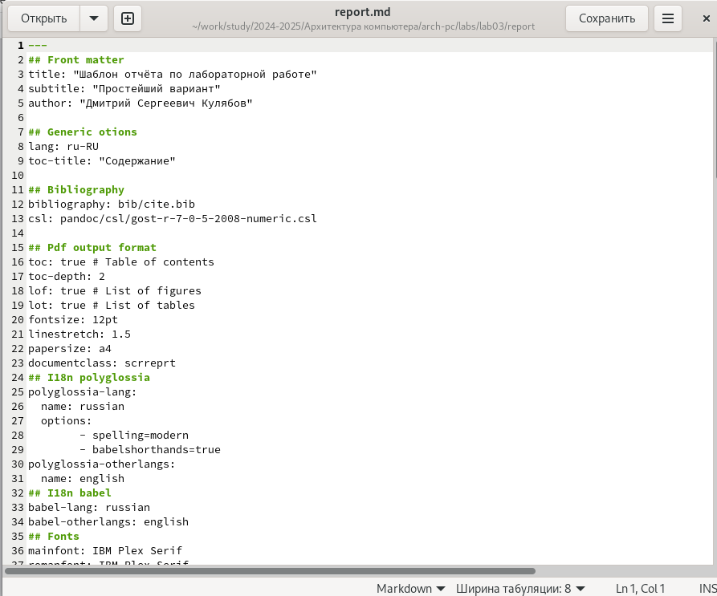
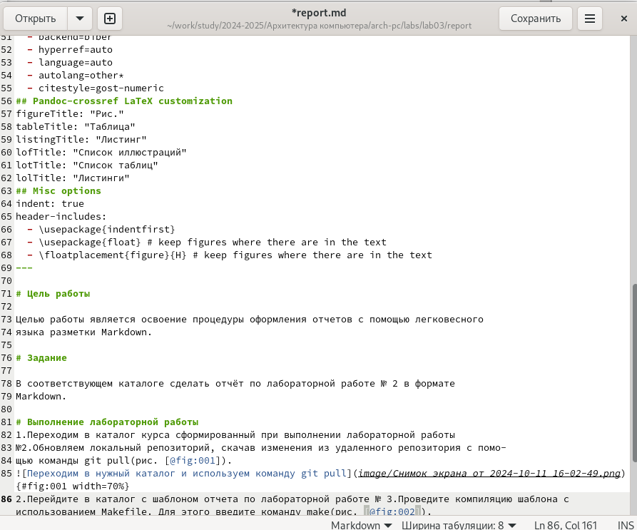
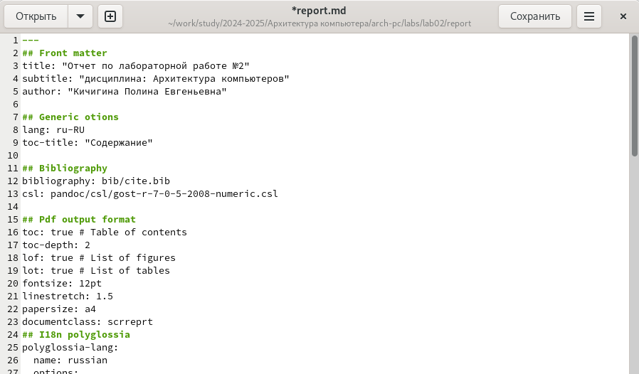

---
## Front matter
title: "Отчет по лабораторной работе №3"
subtitle: "Язык разметки Markdown"
author: "Кичигина Полина Евгеньевна"

## Generic otions
lang: ru-RU
toc-title: "Содержание"

## Bibliography
bibliography: bib/cite.bib
csl: pandoc/csl/gost-r-7-0-5-2008-numeric.csl

## Pdf output format
toc: true # Table of contents
toc-depth: 2
lof: true # List of figures
lot: true # List of tables
fontsize: 12pt
linestretch: 1.5
papersize: a4
documentclass: scrreprt
## I18n polyglossia
polyglossia-lang:
  name: russian
  options:
	- spelling=modern
	- babelshorthands=true
polyglossia-otherlangs:
  name: english
## I18n babel
babel-lang: russian
babel-otherlangs: english
## Fonts
mainfont: IBM Plex Serif
romanfont: IBM Plex Serif
sansfont: IBM Plex Sans
monofont: IBM Plex Mono
mathfont: STIX Two Math
mainfontoptions: Ligatures=Common,Ligatures=TeX,Scale=0.94
romanfontoptions: Ligatures=Common,Ligatures=TeX,Scale=0.94
sansfontoptions: Ligatures=Common,Ligatures=TeX,Scale=MatchLowercase,Scale=0.94
monofontoptions: Scale=MatchLowercase,Scale=0.94,FakeStretch=0.9
mathfontoptions:
## Biblatex
biblatex: true
biblio-style: "gost-numeric"
biblatexoptions:
  - parentracker=true
  - backend=biber
  - hyperref=auto
  - language=auto
  - autolang=other*
  - citestyle=gost-numeric
## Pandoc-crossref LaTeX customization
figureTitle: "Рис."
tableTitle: "Таблица"
listingTitle: "Листинг"
lofTitle: "Список иллюстраций"
lotTitle: "Список таблиц"
lolTitle: "Листинги"
## Misc options
indent: true
header-includes:
  - \usepackage{indentfirst}
  - \usepackage{float} # keep figures where there are in the text
  - \floatplacement{figure}{H} # keep figures where there are in the text
---

# Цель работы

Целью работы является освоение процедуры оформления отчетов с помощью легковесного языка разметки Markdown.

# Задание

В соответствующем каталоге сделать отчёт по лабораторной работе № 2 в формате Markdown. 

# Выполнение лабораторной работы 

1. Переходим в каталог курса сформированный при выполнении лабораторной работы №2.Обновляем локальный репозиторий, скачав изменения из удаленного репозитория с помощью команды git pull(рис. [-@fig:001]).

{#fig:001 width=70%}

2. Перейдите в каталог с шаблоном отчета по лабораторной работе № 3.Проведите компиляцию шаблона с использованием Makefile. Для этого введите команду make(рис. [-@fig:002]).

{#fig:002 width=70%}

При успешной компиляции должны сгенерироваться файлы report.pdf и report.docx.
Открываем и проверяем корректность полученных файлов.(рис. [-@fig:003])

{#fig:003 width=70%}

3. Удаляем полученные файлы с использованием Makefile. Для этого введим команду make clean (рис. [-@fig:004]).

{#fig:004 width=70%}

Проверяем, что после этой команды файлы report.pdf и report.docx были удалены (рис. [-@fig:005]).

{#fig:005 width=70%}

4. Открываем файл report.md c помощью любого текстового редактора, например gedit (рис. [-@fig:006]).
gedit report.md

{#fig:006 width=70%}

Внимательно изучаем структуру этого файла(рис. [-@fig:007]).

{#fig:007 width=70%}

5. Изучив структуру файла, начинаем его изменять(рис. [-@fig:008]).

{#fig:008 width=70%}

# Задания для самостоятельной работы

1. В соответствующем каталоге делаем отчёт по лабораторной работе № 2 в формате
Markdown(рис. [-@fig:009]).

{#fig:009 width=70%}

# Выводы

Мы познакомились с языком разметки Markdown, оформили отчет в ней и загрузили на Github.

