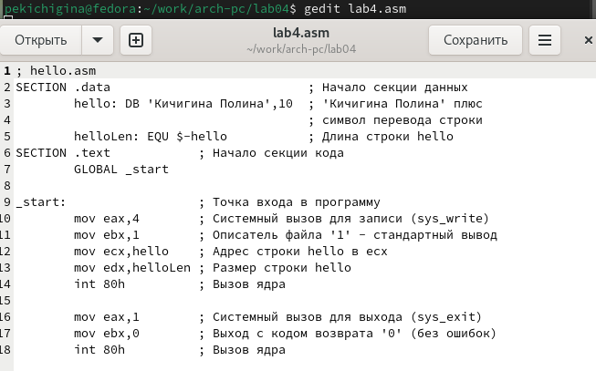

---
## Front matter
title: "Отчет по лабораторной работе №4"
subtitle: "Создание и процесс обработки программ на языке ассемблера NASM"
author: "Кичигина Полина Евгеньевна"

## Generic otions
lang: ru-RU
toc-title: "Содержание"

## Bibliography
bibliography: bib/cite.bib
csl: pandoc/csl/gost-r-7-0-5-2008-numeric.csl

## Pdf output format
toc: true # Table of contents
toc-depth: 2
lof: true # List of figures
lot: true # List of tables
fontsize: 12pt
linestretch: 1.5
papersize: a4
documentclass: scrreprt
## I18n polyglossia
polyglossia-lang:
  name: russian
  options:
	- spelling=modern
	- babelshorthands=true
polyglossia-otherlangs:
  name: english
## I18n babel
babel-lang: russian
babel-otherlangs: english
## Fonts
mainfont: IBM Plex Serif
romanfont: IBM Plex Serif
sansfont: IBM Plex Sans
monofont: IBM Plex Mono
mathfont: STIX Two Math
mainfontoptions: Ligatures=Common,Ligatures=TeX,Scale=0.94
romanfontoptions: Ligatures=Common,Ligatures=TeX,Scale=0.94
sansfontoptions: Ligatures=Common,Ligatures=TeX,Scale=MatchLowercase,Scale=0.94
monofontoptions: Scale=MatchLowercase,Scale=0.94,FakeStretch=0.9
mathfontoptions:
## Biblatex
biblatex: true
biblio-style: "gost-numeric"
biblatexoptions:
  - parentracker=true
  - backend=biber
  - hyperref=auto
  - language=auto
  - autolang=other*
  - citestyle=gost-numeric
## Pandoc-crossref LaTeX customization
figureTitle: "Рис."
tableTitle: "Таблица"
listingTitle: "Листинг"
lofTitle: "Список иллюстраций"
lotTitle: "Список таблиц"
lolTitle: "Листинги"
## Misc options
indent: true
header-includes:
  - \usepackage{indentfirst}
  - \usepackage{float} # keep figures where there are in the text
  - \floatplacement{figure}{H} # keep figures where there are in the text
---

# Цель работы

Освоение процедуры компиляции и сборки программ, написанных на ассемблере NASM.

# Задание

Написать 2 программы: Hello world, lab4(Имя Фамилия))

# Выполнение лабораторной работы

1. Программа Hello world!

Создайте каталог для работы с программами на языке ассемблера NASM и перейдите в созданный каталог(рис. [-@fig:001])

{#fig:001 width=70%}

Создайте текстовый файл с именем hello.asm и откройте этот файл с помощью любого текстового редактора, например, gedit(рис. [-@fig:002])  

{#fig:002 width=70%}

И введите в него следующий текст(рис. [-@fig:003])

{#fig:003 width=70%}

2. Транслятор NASM

Преобразуем текст программы в объектный код и проверим создался ли объектный файл(рис. [-@fig:004])

{#fig:004 width=70%}

3. Расширенный синтаксис командной строки NASM

Компилируем исходный файл и проверяем, как сработала команда(рис. [-@fig:005])

{#fig:005 width=70%}

4. Компоновщик LD

Чтобы получить исполняемую программу, объектный файл необходимо передать на обработку компоновщику(рис. [-@fig:006])

{#fig:006 width=70%}

Выполните следующую команду(рис. [-@fig:007])

{#fig:007 width=70%}

5. Запуск исполняемого файла

Запустить на выполнение созданный исполняемый файл, находящийся в текущем каталоге, можно, набрав в командной строке(рис. [-@fig:008])

{#fig:008 width=70%}

# Задание для самостоятельной работы

1. В каталоге ~/work/arch-pc/lab04 с помощью команды cp создайте копию файла hello.asm с именем lab4.asm(рис. [-@fig:009])

{#fig:009 width=70%}

2. С помощью любого текстового редактора внесите изменения в текст программы в файле lab4.asm так, чтобы вместо Hello world! на экран выводилась строка с вашими фамилией и именем(рис. [-@fig:010])

{#fig:010 width=70%}

3. Оттранслируйте полученный текст программы lab4.asm в объектный файл. Выполните компоновку объектного файла и запустите получившийся исполняемый файл(рис. [-@fig:011])

{#fig:011 width=70%}

4. Скопируйте файлы hello.asm и lab4.asm в Ваш локальный репозиторий в каталог ~/work/study/2023-2024/"Архитектура компьютера"/arch-pc/labs/lab04/(рис. [-@fig:012])

{#fig:012 width=70%}

# Выводы

Мы познакомились с языком ассемблера NASM и создали две работающих программы.

