---
## Front matter
title: "Отчёт по лабораторной работе №5"
subtitle: "Основы работы с Midnight Commander"
author: "Кичигина Полина Евгеньевна"

## Generic otions
lang: ru-RU
toc-title: "Содержание"

## Bibliography
bibliography: bib/cite.bib
csl: pandoc/csl/gost-r-7-0-5-2008-numeric.csl

## Pdf output format
toc: true # Table of contents
toc-depth: 2
lof: true # List of figures
lot: true # List of tables
fontsize: 12pt
linestretch: 1.5
papersize: a4
documentclass: scrreprt
## I18n polyglossia
polyglossia-lang:
  name: russian
  options:
	- spelling=modern
	- babelshorthands=true
polyglossia-otherlangs:
  name: english
## I18n babel
babel-lang: russian
babel-otherlangs: english
## Fonts
mainfont: IBM Plex Serif
romanfont: IBM Plex Serif
sansfont: IBM Plex Sans
monofont: IBM Plex Mono
mathfont: STIX Two Math
mainfontoptions: Ligatures=Common,Ligatures=TeX,Scale=0.94
romanfontoptions: Ligatures=Common,Ligatures=TeX,Scale=0.94
sansfontoptions: Ligatures=Common,Ligatures=TeX,Scale=MatchLowercase,Scale=0.94
monofontoptions: Scale=MatchLowercase,Scale=0.94,FakeStretch=0.9
mathfontoptions:
## Biblatex
biblatex: true
biblio-style: "gost-numeric"
biblatexoptions:
  - parentracker=true
  - backend=biber
  - hyperref=auto
  - language=auto
  - autolang=other*
  - citestyle=gost-numeric
## Pandoc-crossref LaTeX customization
figureTitle: "Рис."
tableTitle: "Таблица"
listingTitle: "Листинг"
lofTitle: "Список иллюстраций"
lotTitle: "Список таблиц"
lolTitle: "Листинги"
## Misc options
indent: true
header-includes:
  - \usepackage{indentfirst}
  - \usepackage{float} # keep figures where there are in the text
  - \floatplacement{figure}{H} # keep figures where there are in the text
---

# Цель работы

Приобретение практических навыков работы в Midnight Commander. Освоение инструкций
языка ассемблера mov и int.

# Задание

Написать 2 программы по примеру и впоследствии изменить их по условию.

# Выполнение лабораторной работы

1. Откройте Midnight Commander(рис. [-@fig:001])

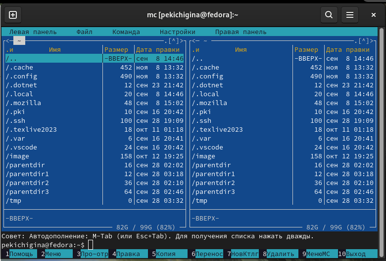{#fig:001 width=70%}

2. Перейдите в каталог ~/work/arch-pc созданный при выполнении лабораторной работы №4(рис. [-@fig:002])

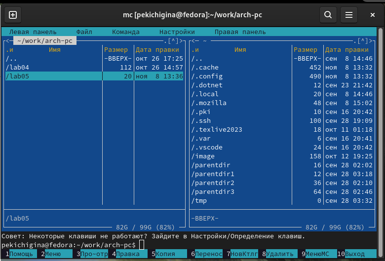{#fig:002 width=70%}

3. Создайте папку lab05 и перейдите в созданный каталог(рис. [-@fig:003])

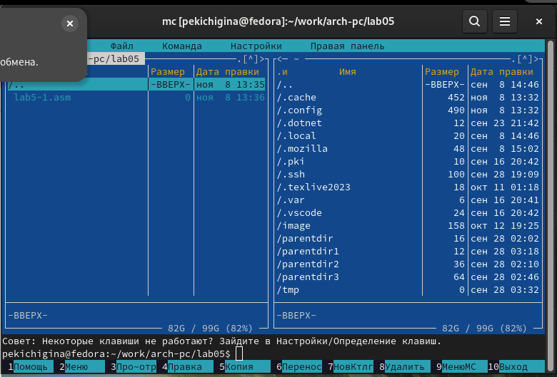{#fig:003 width=70%}

4. Пользуясь строкой ввода и командой touch создайте файл lab5-1.asm

5. Откройте файл lab5-1.asm для редактирования во встроенном редакторе. Как правило в качестве встроенного редактора Midnight Commander используется редакторы nano или mcedit

6. Введите текст программы из листинга 5.1 (можно без комментариев), сохраните изменения и закройте файл(рис. [-@fig:004])

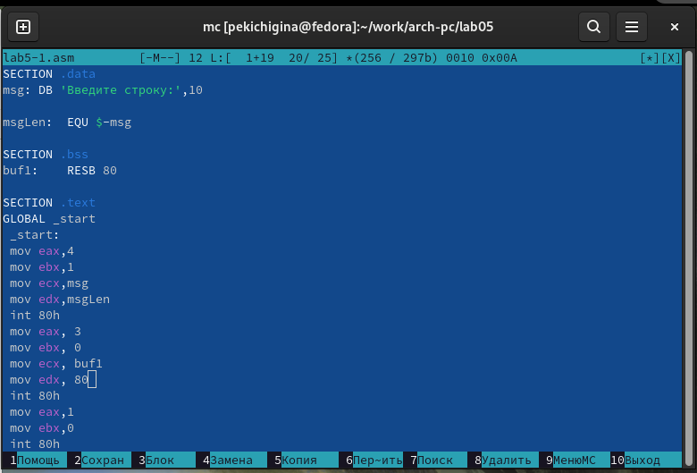{#fig:004 width=70%}

7. Откройте файл lab5-1.asm для просмотра. Убедитесь, что файл содержит текст программы(рис. [-@fig:005])

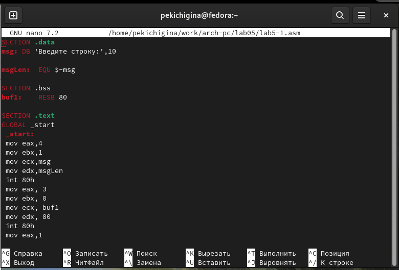{#fig:005 width=70%}

8. Оттранслируйте текст программы lab5-1.asm в объектный файл. Выполните компоновку объектного файла и запустите получившийся исполняемый файл. Программа выводит строку 'Введите строку:' и ожидает ввода с клавиатуры. На запрос введите Ваши ФИО(рис. [-@fig:006])

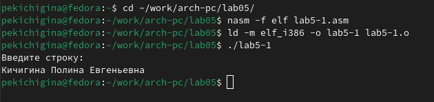{#fig:006 width=70%}

9. Скачайте файл in_out.asm со страницы курса в ТУИС(рис. [-@fig:007])

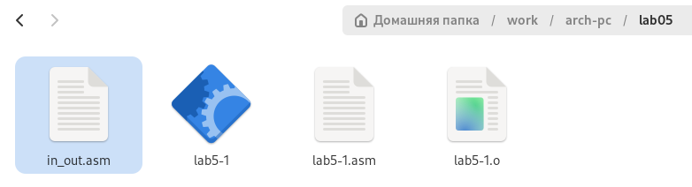{#fig:007 width=70%}

10. Скопируйте файл in_out.asm в каталог с файлом lab5-1.asm(рис. [-@fig:008])

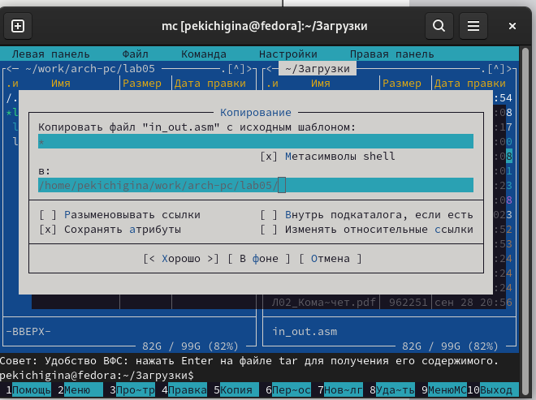{#fig:008 width=70%}

11. Создайте копию файла lab5-1.asm с именем lab5-2.asm(рис. [-@fig:010])

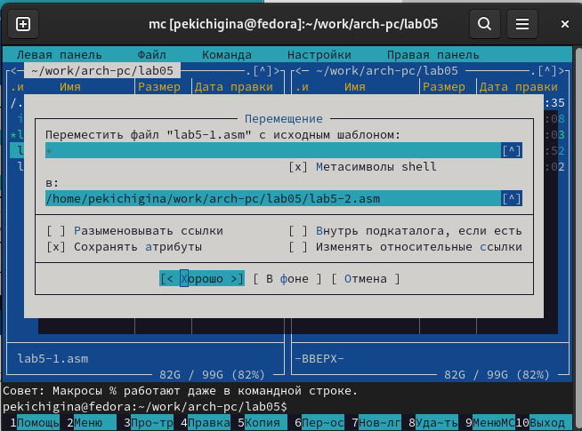{#fig:010 width=70%}

12. Исправьте текст программы в файле lab5-2.asm с использование подпрограмм из внешнего файла in_out.asm (используйте подпрограммы sprintLF, sread и quit) в соответствии с листингом 5.2(рис. [-@fig:012]) 

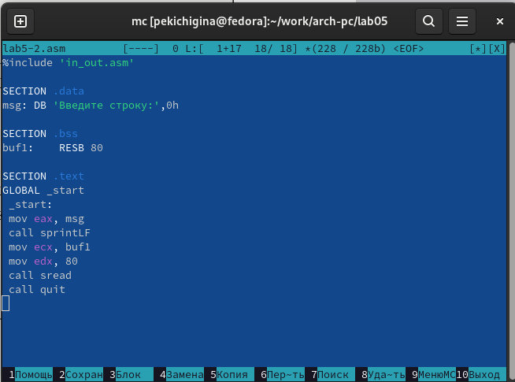{#fig:012 width=70%}

Создайте исполняемый файл и проверьте его работу(рис. [-@fig:013]) 

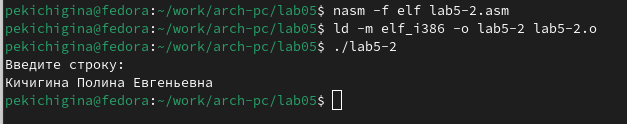{#fig:013 width=70%}

13. В файле lab5-2.asm замените подпрограмму sprintLF на sprint. Создайте исполняемый файл и проверьте его работу. В чем разница?(рис. [-@fig:014])

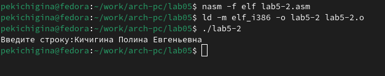{#fig:014 width=70%}

Таким образом можем понять, что команда sprint выводит текст в той же строке, а sprintLF переносит на новую строку.

# Задание для самостоятельной работы

1. Создайте копию файла lab5-1.asm(рис. [-@fig:015])

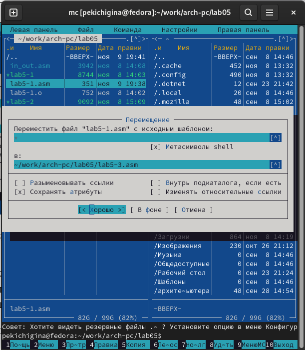{#fig:015 width=70%}

Внесите изменения в программу(рис. [-@fig:016])

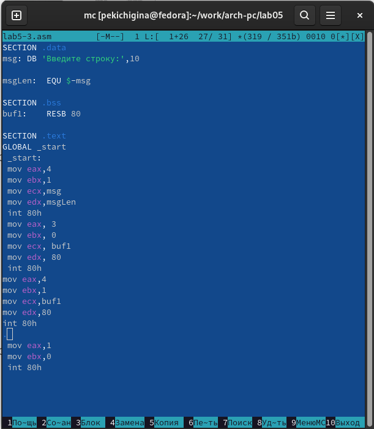{#fig:016 width=70%}

2. Получите исполняемый файл и проверьте его работу. На приглашение ввести строку введите свою фамилию(рис. [-@fig:017])

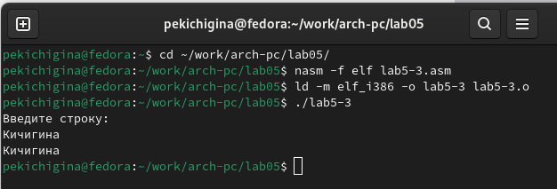{#fig:017 width=70%}

3. Создайте копию файла lab5-2.asm(рис. [-@fig:018])

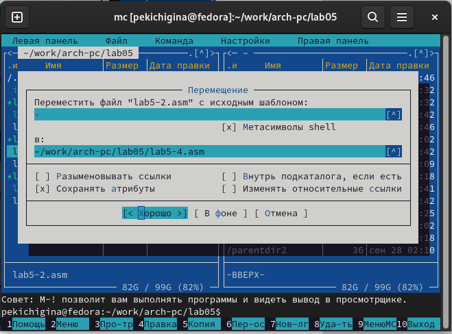{#fig:018 width=70%}

Исправьте текст программы с использование подпрограмм из внешнего файла in_out.asm(рис. [-@fig:019])

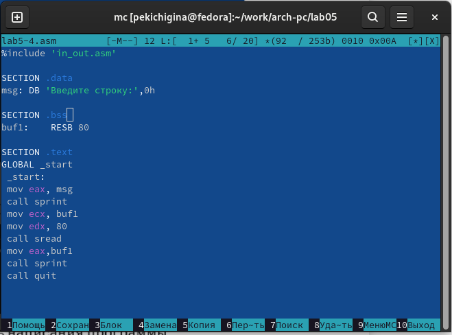{#fig:019 width=70%}

4. Создайте исполняемый файл и проверьте его работу(рис. [-@fig:020])

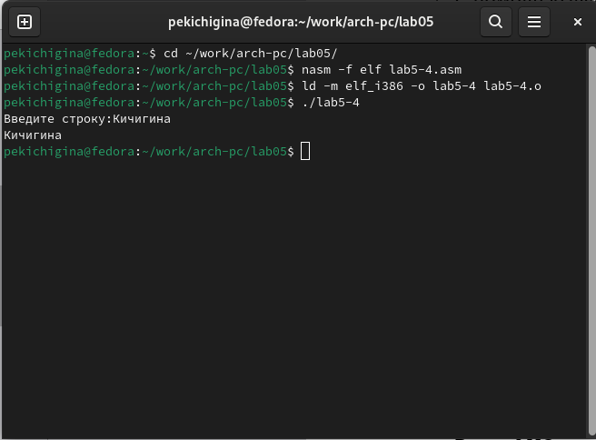{#fig:020 width=70%}

# Выводы

Мы приобрели навыки работы с Midnight Commander и освоили инструкцию mov.

