---
## Front matter
title: "Отчёт по лабораторной работе №6"
subtitle: "Арифметические операции в NASM."
author: "Кичигина Полина Евгеньевна"

## Generic otions
lang: ru-RU
toc-title: "Содержание"

## Bibliography
bibliography: bib/cite.bib
csl: pandoc/csl/gost-r-7-0-5-2008-numeric.csl

## Pdf output format
toc: true # Table of contents
toc-depth: 2
lof: true # List of figures
lot: true # List of tables
fontsize: 12pt
linestretch: 1.5
papersize: a4
documentclass: scrreprt
## I18n polyglossia
polyglossia-lang:
  name: russian
  options:
	- spelling=modern
	- babelshorthands=true
polyglossia-otherlangs:
  name: english
## I18n babel
babel-lang: russian
babel-otherlangs: english
## Fonts
mainfont: IBM Plex Serif
romanfont: IBM Plex Serif
sansfont: IBM Plex Sans
monofont: IBM Plex Mono
mathfont: STIX Two Math
mainfontoptions: Ligatures=Common,Ligatures=TeX,Scale=0.94
romanfontoptions: Ligatures=Common,Ligatures=TeX,Scale=0.94
sansfontoptions: Ligatures=Common,Ligatures=TeX,Scale=MatchLowercase,Scale=0.94
monofontoptions: Scale=MatchLowercase,Scale=0.94,FakeStretch=0.9
mathfontoptions:
## Biblatex
biblatex: true
biblio-style: "gost-numeric"
biblatexoptions:
  - parentracker=true
  - backend=biber
  - hyperref=auto
  - language=auto
  - autolang=other*
  - citestyle=gost-numeric
## Pandoc-crossref LaTeX customization
figureTitle: "Рис."
tableTitle: "Таблица"
listingTitle: "Листинг"
lofTitle: "Список иллюстраций"
lotTitle: "Список таблиц"
lolTitle: "Листинги"
## Misc options
indent: true
header-includes:
  - \usepackage{indentfirst}
  - \usepackage{float} # keep figures where there are in the text
  - \floatplacement{figure}{H} # keep figures where there are in the text
---

# Цель работы

Освоить арифметических инструкций языка ассемблера NASM и написать программы для вычисления арифметических выражений с неизвестной.

# Задание

Написать программы для решения выражений.

# Выполнение лабораторной работы

## Cимвольные и численные данные в NASM

Создаем каталог для программ ЛБ6, и в нем создаем файл (рис. @fig:001)

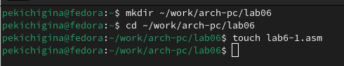{#fig:001 width=70%}

Открываем файл в Midnight Commander и заполняем его в соответствии с листингом 6.1 (рис. @fig:002)

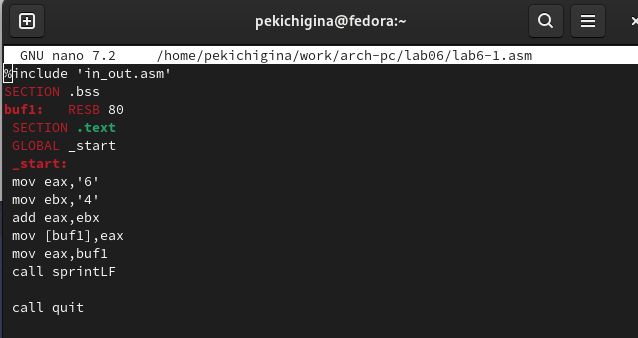{#fig:002 width=70%}

Создаем исполняемый файл и запускаем его (рис. @fig:003)

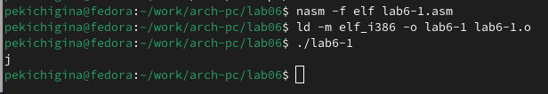{#fig:003 width=70%}

Снова открываем файл для редактирования и убиравем кавычки с числовых значений (рис. @fig:004)

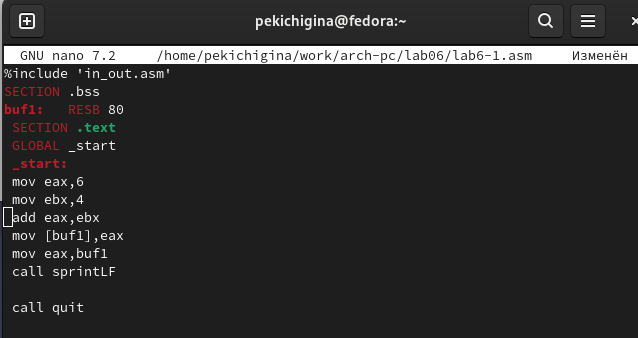{#fig:004 width=70%}

Создаем исполняемый файл и запускаем его (рис. @fig:005)

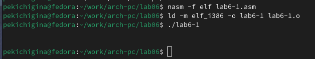{#fig:005 width=70%}

Создаем новый файл в каталоге (рис. @fig:006)

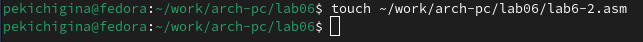{#fig:006 width=70%}

Заполняем файл в соответствии с листингом 6.2 (рис. @fig:007)

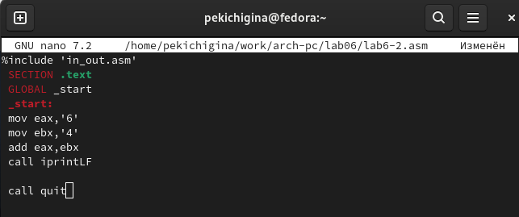{#fig:007 width=70%}

Создаем исполняемый файл и запускаем его (рис. @fig:008)

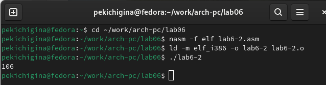{#fig:008 width=70%}

Снова открываем файл для редактирования и убиравем кавычки с числовых значений (рис. @fig:009)

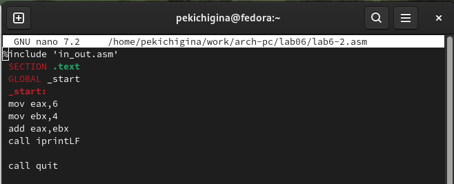{#fig:009 width=70%}

Создаем исполняемый файл и запускаем его (рис. @fig:010)

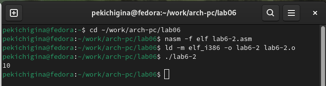{#fig:010 width=70%}

Снова открываем файл для редактирования и меняем iprintLF на iprint

Создаем исполняемый файл и запускаем его (рис. @fig:011)

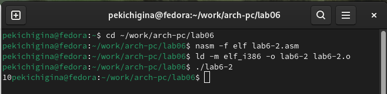{#fig:011 width=70%}

Вывод функций iprintLF и iprint отличаются только тем, что LF переносит на новую строку.

## Выполнение арифметических операций в NASM

Создаем новый файл в каталоге (рис. @fig:012)

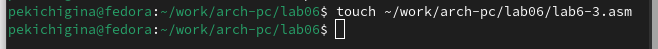{#fig:012 width=70%}

Открываем файл и редактируем в соответствии с листингом 6.3 (рис. @fig:013)

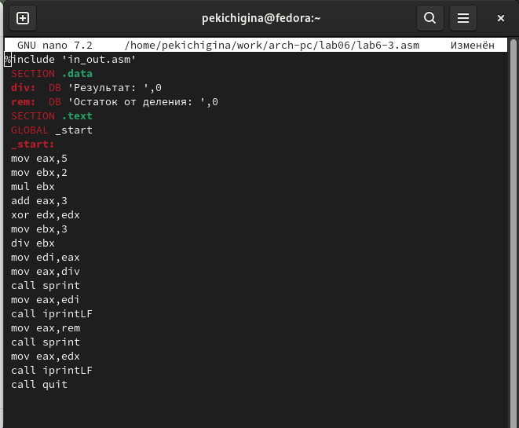{#fig:013 width=70%}

Создаем исполняемый файл и запускаем его (рис. @fig:014)

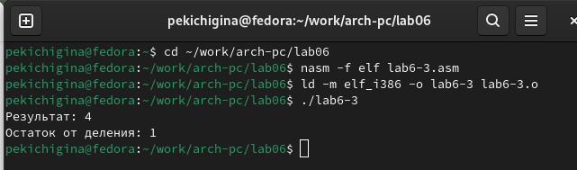{#fig:014 width=70%}

Открываем файл и редактируем его для вычисления выражения f(x) = (4 * 6 + 2)/5 (рис. @fig:015)

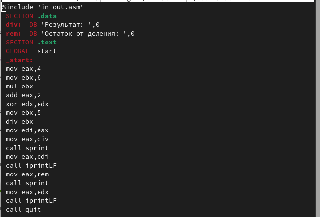{#fig:015 width=70%}

Компилируем файл и запускаем программу (рис. @fig:016)

{#fig:016 width=70%}

Создаем новый файл в каталоге (рис. @fig:017)

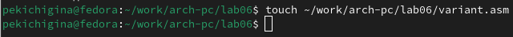{#fig:017 width=70%}

Открываем файл и редактируем в соответствии с листингом 6.4 (рис. @fig:018)

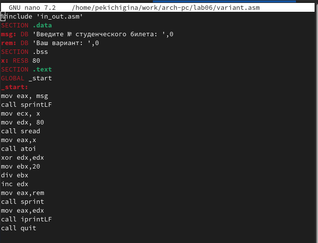{#fig:018 width=70%}

Компилируем файл и запускаем его (рис. @fig:019)

{#fig:019 width=70%}

## Ответы на вопросы по программе

1. Строка "mov eax,rem" и строка "call sprint" отвечают за вывод на экран сообщения ‘Ваш вариант:'.

2. Эти инструкции используются для чтения строки с вводом данных от пользователя. Начальный адрес строки сохраняется в регистре ecx, а количество символов в строке (максимальное количество символов, которое может быть считано) сохраняется в регистре edx. Затем вызывается процедура sread, которая выполняет чтение строки.

3. Инструкция "call atoi" используется для преобразования строки в целое число. Она принимает адрес строки в регистре eax и возвращает полученное число в регистре eax.

4. Строка "xor edx,edx" обнуляет регистр edx перед выполнением деления. Строка "mov ebx,20" загружает значение 20 в регистр ebx. Строка "div ebx" выполняет деление регистра eax на значение регистра ebx с сохранением частного в регистре eax и остатка в регистре edx.

5. Остаток от деления записывается в регистр edx.

6. Инструкция "inc edx" используется для увеличения значения в регистре edx на 1. В данном случае, она увеличивает остаток от деления на 1.

7. Строка "mov eax,edx" передает значение остатка от деления в регистр eax. Строка "call iprintLF" вызывает процедуру iprintLF для вывода значения на экран вместе с переводом строки.

## Задание для самостоятельной работы

Создаем новый файл в каталоге (рис. @fig:020)

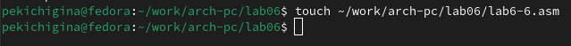{#fig:020 width=70%}

Открываем его и заполняем, чтобы решалось выражение f(x)=(x^3)/2 + 1(рис. @fig:021)

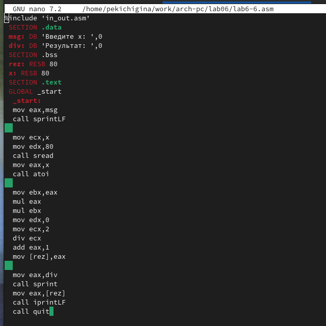{#fig:021 width=70%}

Компилируем программу и проверяем для x=2 

Компилируем программу и проверяем для x=5 (рис. @fig:022).

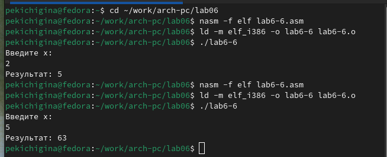{#fig:022 width=70%}

# Выводы

Мы приобрели навыки создания исполнительных файлов для решения выражений и освоили арифметические инструкции в NASM.
