---
## Front matter
title: "Отчёта по лабораторной работе №7"
subtitle: "Команды безусловного и условного переходов в Nasm. Программирование ветвлений"
author: "Кичигина Полина Евгеньевна"

## Generic otions
lang: ru-RU
toc-title: "Содержание"

## Bibliography
bibliography: bib/cite.bib
csl: pandoc/csl/gost-r-7-0-5-2008-numeric.csl

## Pdf output format
toc: true # Table of contents
toc-depth: 2
lof: true # List of figures
lot: true # List of tables
fontsize: 12pt
linestretch: 1.5
papersize: a4
documentclass: scrreprt
## I18n polyglossia
polyglossia-lang:
  name: russian
  options:
	- spelling=modern
	- babelshorthands=true
polyglossia-otherlangs:
  name: english
## I18n babel
babel-lang: russian
babel-otherlangs: english
## Fonts
mainfont: IBM Plex Serif
romanfont: IBM Plex Serif
sansfont: IBM Plex Sans
monofont: IBM Plex Mono
mathfont: STIX Two Math
mainfontoptions: Ligatures=Common,Ligatures=TeX,Scale=0.94
romanfontoptions: Ligatures=Common,Ligatures=TeX,Scale=0.94
sansfontoptions: Ligatures=Common,Ligatures=TeX,Scale=MatchLowercase,Scale=0.94
monofontoptions: Scale=MatchLowercase,Scale=0.94,FakeStretch=0.9
mathfontoptions:
## Biblatex
biblatex: true
biblio-style: "gost-numeric"
biblatexoptions:
  - parentracker=true
  - backend=biber
  - hyperref=auto
  - language=auto
  - autolang=other*
  - citestyle=gost-numeric
## Pandoc-crossref LaTeX customization
figureTitle: "Рис."
tableTitle: "Таблица"
listingTitle: "Листинг"
lofTitle: "Список иллюстраций"
lotTitle: "Список таблиц"
lolTitle: "Листинги"
## Misc options
indent: true
header-includes:
  - \usepackage{indentfirst}
  - \usepackage{float} # keep figures where there are in the text
  - \floatplacement{figure}{H} # keep figures where there are in the text
---

# Цель работы

Освоить условного и безусловного перехода. Ознакомиться с назначением и структурой файла листинга.

# Задание

Написать программы для решения системы выражений.

# Выполнение лабораторной работы

1. Создайте каталог для программам лабораторной работы № 7, перейдите в него и со-
здайте файл lab7-1.asm(рис. [-@fig:001])

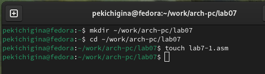{#fig:001 width=70%}

2. Инструкция jmp в NASM используется для реализации безусловных переходов. Рассмот-
рим пример программы с использованием инструкции jmp. Введите в файл lab7-1.asm
текст программы из листинга 7.1(рис. [-@fig:002])

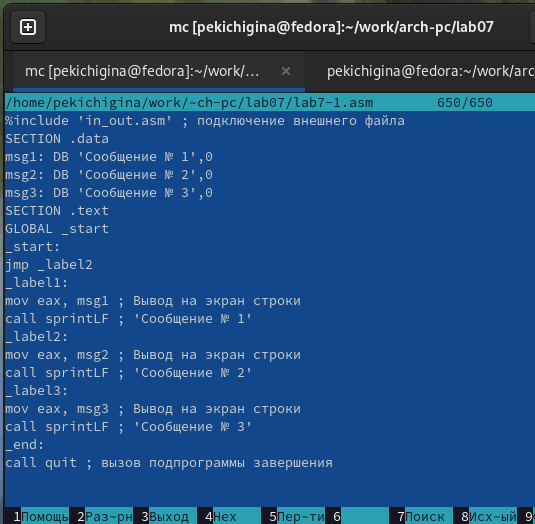{#fig:002 width=70%}

Создайте исполняемый файл и запустите его(рис. [-@fig:003])

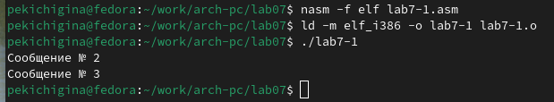{#fig:003 width=70%}

Изменим программу таким образом, чтобы она выводила сначала ‘Сообщение № 2’, потом ‘Сообщение № 1’ и завершала работу. Для этого в текст программы после вывода сообщения № 2 добавим инструкцию jmp с меткой _label1 (т.е. переход к инструкциям вывода сообщения № 1) и после вывода сообщения № 1 добавим инструкцию jmp с меткой _end (т.е. переход к инструкции call quit). Измените текст программы в соответствии с листингом 7.2(рис. [-@fig:004])

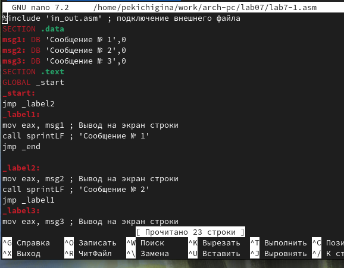{#fig:004 width=70%}

Создайте исполняемый файл и проверьте его работу(рис. [-@fig:005])

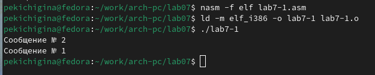{#fig:005 width=70%}

Измените текст программы добавив или изменив инструкции jmp, чтобы вывод програм-
мы был следующим:

Сообщение № 3
Сообщение № 2
Сообщение № 1(рис. [-@fig:006])

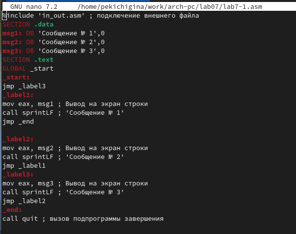{#fig:006 width=70%}

Теперь проверяем работу программы(рис. [-@fig:007])

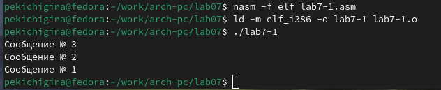{#fig:007 width=70%}

3. Создайте файл lab7-2.asm в каталоге ~/work/arch-pc/lab07. Внимательно изучите текст
программы из листинга 7.3 и введите в lab7-2.asm(рис. [-@fig:008])

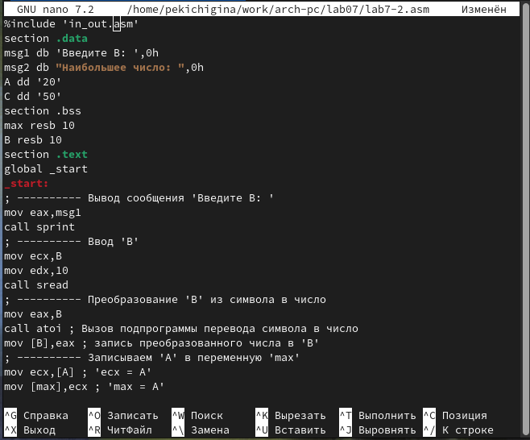{#fig:008 width=70%}

Создайте исполняемый файл и проверьте его работу для разных значений B(рис. [-@fig:009])

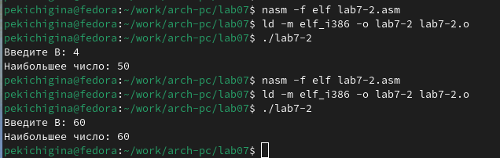{#fig:009 width=70%}

4. Создайте файл листинга для программы из файла lab7-2.asm(рис. [-@fig:010])

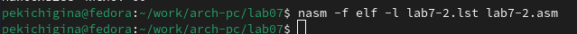{#fig:010 width=70%}

Откройте файл листинга lab7-2.lst с помощью любого текстового редактора, например
mcedit. Внимательно ознакомиться с его форматом и содержимым. Подробно объяснить содержи-
мое трёх строк файла листинга по выбору.

Строка 33: 0000001D-адрес в сегменте кода, BB01000000-машинный код, mov ebx,1-присвоение переменной ecx значения 1.

Строка 34: 00000022-адрес в сегменте кода, B804000000-машинный код, mov eax,4-присвоение переменной eax значения 4.

Строка 35: 00000027-адрес в сегменте кода, CD80-машинный код, int 80h-вызов ядра.

Откройте файл с программой lab7-2.asm и в любой инструкции с двумя операндами
удалить один операнд. Выполните трансляцию с получением файла листинга.

Какие выходные файлы создаются в этом случае? Что добавляется в листинге?
При трансляции файла, выдается ошибка, но создаются исполнительный файл lab7-2 и lab7-2.lst(рис. [-@fig:011])

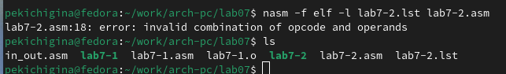{#fig:011 width=70%}

# Задания для самостоятельной работы

1. Напишите программу нахождения наименьшей из 3 целочисленных переменных a, b и c.
Значения переменных выбрать из табл. 7.5 в соответствии с вариантом, полученным при выполнении лабораторной работы № 6(рис. [-@fig:012])

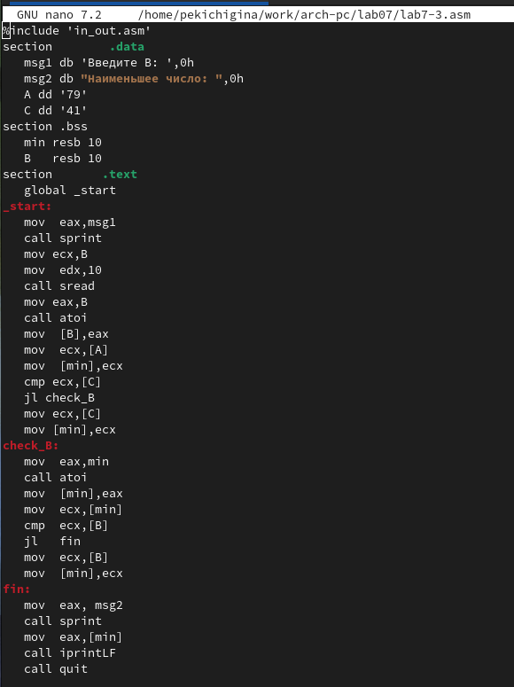{#fig:012 width=70%}

Создайте исполняемый файл и проверьте его работу(рис. [-@fig:013])

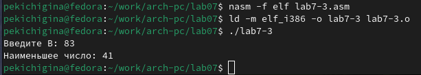{#fig:013 width=70%}

2. Напишите программу, которая для введенных с клавиатуры значений x и a вычисляет значение заданной функции f(x) и выводит результат вычислений. Вид функции f(x) выбрать из таблицы 7.6 вариантов заданий в соответствии с вариантом, полученным при выполнении лабораторной работы № 6(рис. [-@fig:014])

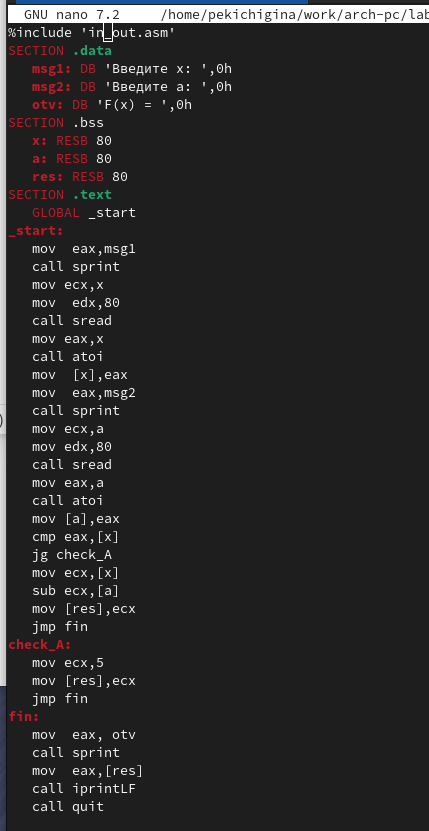{#fig:014 width=70%}

Создайте исполняемый файл и проверьте его работу для значений х и а из 7.6(рис. [-@fig:015])

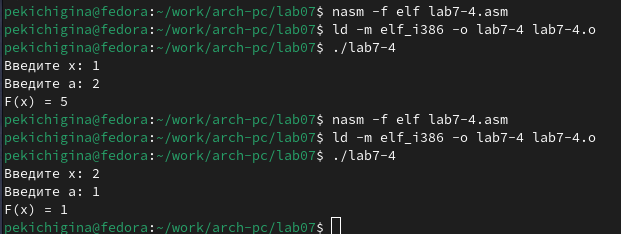{#fig:015 width=70%}

# Выводы

Мы познакомились с структурой файла листинга, изучили команды условного и безусловного перехода.

